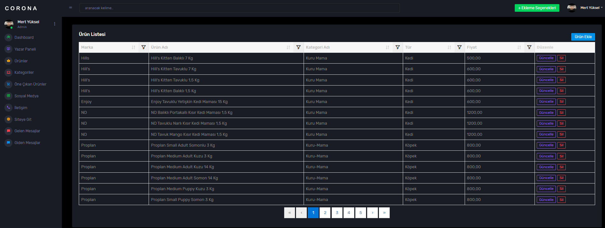

<!-- Improved compatibility of back to top link: See: https://github.com/othneildrew/Best-README-Template/pull/73 -->
<a id="readme-top"></a>

<!-- PROJECT SHIELDS -->


[![MIT License][license-shield]][license-url]


<!-- PROJECT LOGO -->
<br />
<div align="center">
  <a href="https://github.com/ertanguclu/AtlantisPetMarket">
    
  </a>

  <h2 align="center">ATLANTİS PET MARKET</h2>

  <p align="center">
    <br />
    <!-- <a href="https://github.com/your_username/repo_name">View Demo</a> -->
    
<a href="mailto:mertyuksel680@gmail.com?subject=Bug%20Report">Report Bug</a>

    
  </p>
</div>

<!-- TABLE OF CONTENTS -->
<details>
  <summary>Table of Contents</summary>
  <ol>
    <li>
      <a href="#about-the-project">About The Project</a>
     </li>
    <li>
      <a href="#getting-started">Getting Started</a>
      <ul>
        <li><a href="#prerequisites">Prerequisites</a></li>
        <li><a href="#installation">Installation</a></li>
      </ul>
    </li>
    <li><a href="#usage">Usage</a></li>
    <li><a href="#technologies-used">Technologies Used</a></li>
    <li><a href="#license">License</a></li>
    <li><a href="#contact">Contact</a></li>
    
  </ol>
</details>

<!-- ABOUT THE PROJECT -->
## About The Project


**AtlantisPetMarket** is a comprehensive web application designed to enhance the e-commerce experience in the pet shop industry. This project enables users to easily find, purchase, and manage pet products. It also provides a powerful admin panel for users to add, edit, and delete products and categories.

<p align="right">(<a href="#readme-top">back to top</a>)</p>

<!-- GETTING STARTED -->
## Getting Started

To get started with the AtlantisPetMarket project, follow these steps to set it up and run it on your local environment.

### Prerequisites

Before running the project, ensure you have the following tools and software installed:

- **.NET SDK**: Install .NET Core 8.0 or newer to develop and run the project. [Download .NET SDK](https://dotnet.microsoft.com/download).
- **MySQL Server**: You need to have MySQL Server installed for database management. [Download MySQL Server](https://dev.mysql.com/downloads/).

### Installation

Follow these steps to install and set up the application:

1. Clone the repo
   ```sh
   git clone https://github.com/ertanguclu/AtlantisPetMarket.git

   ```
2. Restore DOTNET packages
   ```sh
   dotnet restore

   ```
3. Configure the database connection in your appsettings.json file, configure the ConnectionStrings section as follows:
```json
{
  "ConnectionStrings": {
    "DefaultConnection": "server=localhost;database=atlantis_pet_market;user=root;password=yourpassword"
  }
}
```


<p align="right">(<a href="#readme-top">back to top</a>)</p>


<!-- USAGE EXAMPLES -->
## Usage

<h3>HomePage</h3>
The homepage serves as the main entry point for users to navigate and view the general layout of the website. Here, you can find information about popular products, categories, and promotions. By exploring the homepage, you can discover your products and start shopping.


<h3>Product Listing</h3>
The Product Listing page displays a list of all available products. Users can browse through different products, view details such as name, price, category, and stock status. This page makes it easy to explore the product catalog and find specific items you want to purchase.


<h3>Add to Cart</h3>
The Add to Cart feature allows users to select products from the Product Listing or Product Details pages and add them to their shopping cart. Users can easily manage their selections, view the total price, and proceed to checkout when they are ready to complete their purchase.


<h3>Product Create</h3>
The Product Create page allows administrators to add new products. On this page, you can enter information such as the product name, description, price, stock status, and category to save new products to the database. The product creation process is straightforward and user-friendly.





<h3>Category Create</h3>
The Category Create page is used to create new product categories. On this page, you can define new categories to group and organize products. Categories make it easier to organize your products and help users find the products they are looking for more easily.


<h3>Login</h3>
The Login page allows users to access their accounts. By entering their username and password, users can access their personal accounts, manage their shopping history, favorite products, and shopping cart.


<p align="right">(<a href="#readme-top">back to top</a>)</p>


<!-- ROADMAP -->


<!-- CONTRIBUTING -->
## Technologies Used

- **ASP.NET Core**: A cross-platform, high-performance framework for building modern, cloud-based, and internet-connected applications. It serves as the foundation for creating web APIs, web apps, and microservices.

- **Entity Framework Core**: An object-relational mapper (ORM) for .NET that simplifies data access by allowing developers to interact with a database using .NET objects rather than raw SQL queries.

- **ASP.NET MVC**: A framework for building web applications using the Model-View-Controller pattern, which separates application logic, user interface, and input control.


- **ASP.NET Identity Core**: A membership system in ASP.NET Core for managing user authentication and authorization, enabling secure user account management, including roles and claims.

- **View Models**: Classes used to encapsulate data for views, providing a way to pass data from the controller to the view and handle the presentation logic.

- **FluentValidation**: A library that provides a fluent interface for building strongly-typed validation rules, ensuring data integrity within .NET applications.

- **AutoMapper**: A library that automates the process of mapping properties from one object to another, reducing boilerplate code and simplifying object-to-object mapping.

- **Components**: Reusable, encapsulated parts of the UI that are used across different pages or views, enhancing modularity and code reusability.

- **Partial Views**: A feature in ASP.NET Core MVC that allows rendering a portion of a view within another view, helping to break down complex pages into smaller, manageable pieces.

- **Generic Repository**: A design pattern that provides a generic interface for CRUD operations, making data access more reusable and easier to maintain across different entity types.

- **N-Tier Architecture**: A software architecture model that divides the application into multiple layers (tiers), such as presentation, business logic, and data access, promoting separation of concerns and scalability.

- **Non-Factor Grid**: A flexible, responsive grid layout system that adapts to various screen sizes and orientations, ensuring a consistent and accessible user interface.
- **Cookies**: Small data files stored on the user's device by the web browser, used to maintain user session state, preferences, and track user activity across different sessions, enhancing the user experience and application functionality.


<!-- LICENSE -->
## License

Distributed under the MIT License. See [LICENSE.txt](./LICENSE.txt) for more information.


<p align="right">(<a href="#readme-top">back to top</a>)</p>


<!-- CONTACT -->
## Contact
We’d love to hear from you! Whether you have questions, feedback, or just want to connect, feel free to reach out to us through the following channels:

- **Ertan Güçlü** - [Linkedin](https://www.linkedin.com/in/ertanguclu/) - ertanguclu@gmail.com
- **Mert Yüksel** - [Linkedin](https://www.linkedin.com/in/mert-y%C3%BCksel/) - mertyuksel680@gmail.com
- **Seyhun Koçak** - [Linkedin](https://www.linkedin.com/in/seyhunkocak/) - seyhunkocak11@gmail.com

Feel free to connect with us on LinkedIn for updates and professional networking. For any inquiries or support, don’t hesitate to drop us an email. We’re here to assist you and look forward to engaging with you!

Project Link: [Atlantis Pet Market](https://github.com/ertanguclu/AtlantisPetMarket)

<p align="right">(<a href="#readme-top">back to top</a>)</p>


<!-- MARKDOWN LINKS & IMAGES -->
<!-- https://www.markdownguide.org/basic-syntax/#reference-style-links -->
[contributors-shield]: https://img.shields.io/github/contributors/othneildrew/Best-README-Template.svg?style=for-the-badge
[contributors-url]: https://github.com/othneildrew/Best-README-Template/graphs/contributors
[forks-shield]: https://img.shields.io/github/forks/othneildrew/Best-README-Template.svg?style=for-the-badge
[forks-url]: https://github.com/othneildrew/Best-README-Template/network/members
[stars-shield]: https://img.shields.io/github/stars/othneildrew/Best-README-Template.svg?style=for-the-badge
[stars-url]: https://github.com/othneildrew/Best-README-Template/stargazers
[issues-shield]: https://img.shields.io/github/issues/othneildrew/Best-README-Template.svg?style=for-the-badge
[issues-url]: https://github.com/othneildrew/Best-README-Template/issues
[license-shield]: https://img.shields.io/github/license/othneildrew/Best-README-Template.svg?style=for-the-badge
[license-url]: https://github.com/othneildrew/Best-README-Template/blob/master/LICENSE.txt
[linkedin-shield]: https://img.shields.io/badge/-LinkedIn-black.svg?style=for-the-badge&logo=linkedin&colorB=555
[linkedin-url]: https://linkedin.com/in/othneildrew
[product-screenshot]: images/screenshot.png
[Next.js]: https://img.shields.io/badge/next.js-000000?style=for-the-badge&logo=nextdotjs&logoColor=white
[Next-url]: https://nextjs.org/
[React.js]: https://img.shields.io/badge/React-20232A?style=for-the-badge&logo=react&logoColor=61DAFB
[React-url]: https://reactjs.org/
[Vue.js]: https://img.shields.io/badge/Vue.js-35495E?style=for-the-badge&logo=vuedotjs&logoColor=4FC08D
[Vue-url]: https://vuejs.org/
[Angular.io]: https://img.shields.io/badge/Angular-DD0031?style=for-the-badge&logo=angular&logoColor=white
[Angular-url]: https://angular.io/
[Svelte.dev]: https://img.shields.io/badge/Svelte-4A4A55?style=for-the-badge&logo=svelte&logoColor=FF3E00
[Svelte-url]: https://svelte.dev/
[Laravel.com]: https://img.shields.io/badge/Laravel-FF2D20?style=for-the-badge&logo=laravel&logoColor=white
[Laravel-url]: https://laravel.com
[Bootstrap.com]: https://img.shields.io/badge/Bootstrap-563D7C?style=for-the-badge&logo=bootstrap&logoColor=white
[Bootstrap-url]: https://getbootstrap.com
[JQuery.com]: https://img.shields.io/badge/jQuery-0769AD?style=for-the-badge&logo=jquery&logoColor=white
[JQuery-url]: https://jquery.com 
